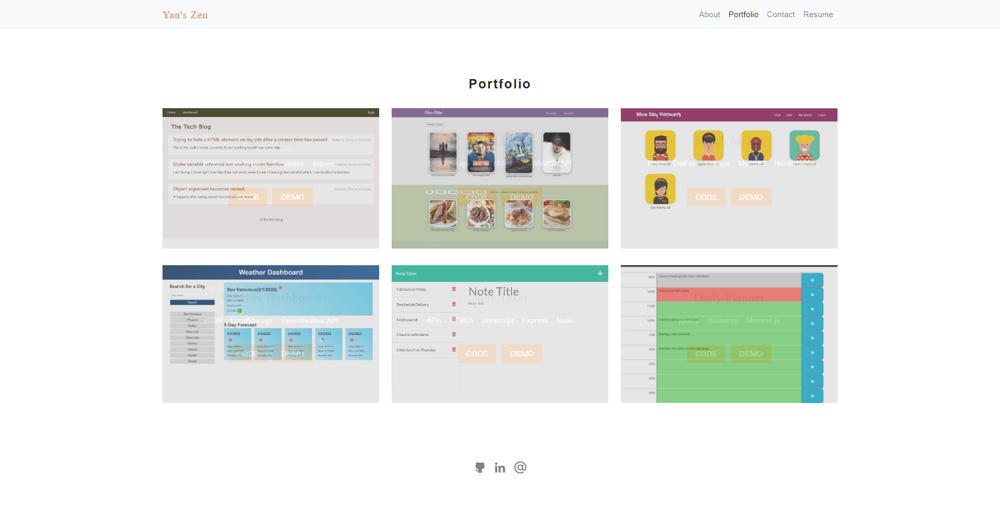

# React Portfolio
 
## Description 
This is a portfolio which is created using React. 

## Usage
visit the website: <a href="https://yanbud.github.io/react-portfolio/">https://yanbud.github.io/react-portfolio/</a>
## Screenshot
 

## Links

<a href="https://yanbud.github.io/react-portfolio/" target="_blank">https://yanbud.github.io/react-portfolio/</a>

<a href="https://github.com/Yanbud/react-portfolio">https://github.com/Yanbud/react-portfolio</a>

## License
This project is licensed under the MIT license.
